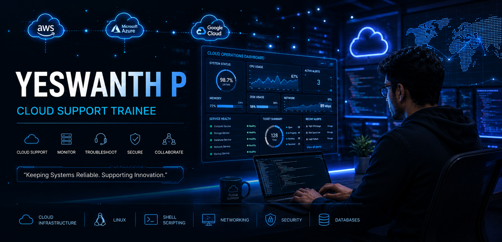

<h1 align="center">YESWANTH P</h1>

Cloud Support Engineer • AWS • Linux • Networking

<!-- Static SVG Badges for Contact Info -->

  
  
  

---

## 👨‍💻 About Me

Meticulous IT graduate with an **M.Sc. in Computer Science**, seeking a Cloud Support role to leverage foundational knowledge in **AWS, Linux system administration, and network configuration**. Proven ability to troubleshoot IT environments, handle technical queries, and deliver reliable customer support.

- 🔭 I’m currently focused on **Cloud Infrastructure, System Monitoring, and Incident Management**.
- 🌱 Building deep expertise in **AWS Fundamentals, Automation Scripting, and Networking (TCP/IP)**.
- 🏏 Beyond the terminal, I'm a passionate cricketer—having captained my college team—and enjoy unwinding with matches, Real Cricket 24, and Free Fire MAX.
- 📫 Reach out to me for: IT Support, Infrastructure Operations, or a good chat about cricket!

---

## 🛠️ Technical Skills & Tools

**Cloud & OS:**

  

**Programming & Databases:**

  

**Networking, Ticketing & Monitoring:**

  <kbd>TCP/IP</kbd> &nbsp; <kbd>DNS</kbd> &nbsp; <kbd>DHCP</kbd> &nbsp; <kbd>Subnetting</kbd> &nbsp; <kbd>Routing Basics</kbd> &nbsp; <kbd>ServiceNow</kbd> &nbsp; <kbd>Jira Helpdesk</kbd> &nbsp; <kbd>AWS CloudWatch</kbd> &nbsp; <kbd>Splunk</kbd>

---

## 🎓 Education

| Degree / Program | Institution | Duration |
| :--- | :--- | :--- |
| <kbd>M.Sc. Computer Science</kbd> | **Sankara College of Science and Commerce**, Coimbatore | <kbd>Jul 2024 – May 2026</kbd> |
| <kbd>B.Sc. Information Technology</kbd> | **Sankara College of Science and Commerce**, Coimbatore | <kbd>Jul 2021 – Jun 2024</kbd> |

---

## 🏆 Certifications & Training

| Certification / Training | Organization / Partner | Date / Status |
| :--- | :--- | :--- |
| <kbd>AWS Certified Cloud Practitioner & Tech Essentials</kbd> | AWS | <kbd>Jan 2026</kbd> |
| <kbd>Corporate Level Training: Django Framework</kbd> | Postulate *(Passed with Distinction)* | <kbd>2023 – 2024</kbd> |
| <kbd>Python Programming, AI & Machine Learning</kbd> | Coursera & Microsoft | <kbd>2025</kbd> |
| <kbd>Employability & Life Skills Training</kbd> | EIDOS | <kbd>Jun 2023</kbd> |
| <kbd>Cyber Security & Next-Gen Data Science AI</kbd> | ATAL FDP | <kbd>Completed</kbd> |

---

## 🚀 Academic Projects

| Project Name | Technology / Stack | Key Features & Achievements |
| :--- | :--- | :--- |
| **Secure Medical Data Protection** | <kbd>MySQL</kbd> <kbd>AES Encryption</kbd> | • Built system with role-based access (Admin, Nurse, Doctor). • Integrated AES encryption for 100% of patient records. • Added geo-location tracking for secure admin logins. |
| **Real-Time Cryptocurrency Tracker** | <kbd>Python</kbd> <kbd>REST APIs</kbd> | • Consumed 5 REST APIs to actively display crypto data. • Parsed JSON to populate 4 dynamic UI components. • Established error-handling for 24/7 reliable data retrieval. |

---

## 🏏 Extra-Curricular & Achievements

| Role / Award | Organization / Event | Duration | Details |
| :--- | :--- | :--- | :--- |
| <kbd>Captain</kbd> | Sankara College Cricket Team | <kbd>Jul 2023 – May 2024</kbd> | Led a 15-member team, organized weekly practice, and fostered team collaboration. |
| <kbd>Best Outgoing Player</kbd> | Sankara College Athletics | <kbd>2025 – 2026</kbd> | Awarded top athletic honor among 500+ students. |
| <kbd>Best Cricketer of the Year</kbd> | Sankara College Athletics | <kbd>2022 – 2023</kbd> | Recognized for outstanding performance and leadership on the field. |

---
## 📊 GitHub Analytics

  

 

  

---

## 💡 Philosophy

  

